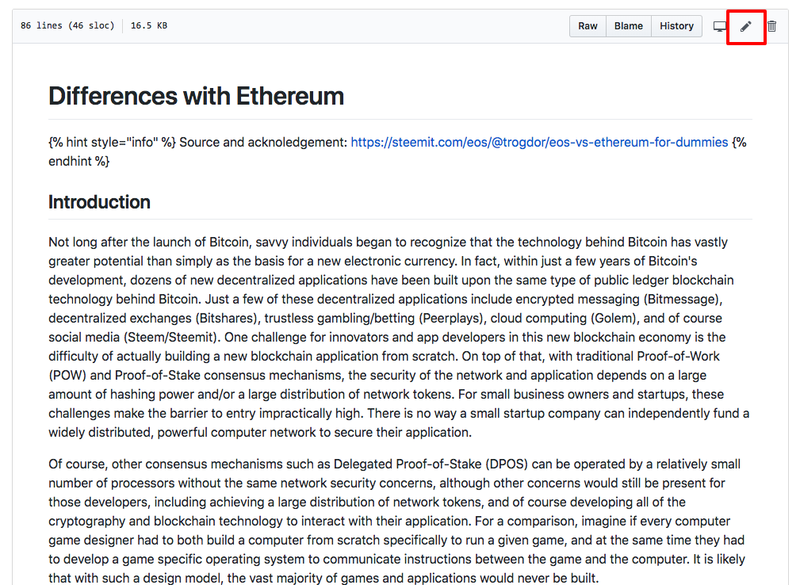
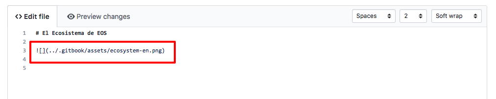

# How to Participate?

## In which ways may I contribute to the EOSpedia.io Project?

### **Do you want to help to support a new language?**

**BECOME A LANGUAGE COORDINATOR**

We are currently supporting English and Spanish as the first languages for **EOSpedia.io**, if you are interested in supporting a new language, please contact us so we can work together to enable new languages as we go.

We want to contact community members that have the desire to become a **Language Coordinator** to organize the efforts for each language so we can reach the whole EOS Community in their own language.

### Do you want to help translating content?

**BECOME A TRANSLATOR**

The base repository or “master” branch of **EOSpedia.io** is in English because this is the most widespread second language around the globe and it will be easier this way to translate from/to it.

Once a change is approved into the “master” repository those changes need to be translated to all other languages, and this is when the **Translator** steps in, the **Language Coordinators** will be in contact with the **Translators** to indicate the changes that are pending and work together to maintain the pages up to date.

### Do you want to add new sections or articles?

**BECOME A CONTENT CREATOR**

If you are a **Content Creator** and want to help **EOSpedia.io** adding new sections or articles \(these may be original articles or existing articles that you want to help incorporate into the repository\) we can collaborate through our telegram channel in order to maintain the contents organized and find the right place for your section/article.

New content needs to come with its English version so we can add it to the “master” branch and spread it to other languages.

If you have the article in your language but you can’t translate it to English you may contact us through the telegram channel and we will try to find a **Translator** or **Language Coordinator** that can help you with the task.

## Communication Channels

* **Email** for initial contact and information, find us at: [eospedia@eosargentina.io](mailto:eospedia@eosargentina.io) 
* **Telegram** and **WeChat** for faster coordination and collaboration
  * Join us in Telegram at [t.me/eospediaio](https://t.me/eospediaio) 
  * To join us in WeChat, please send us an email with your username and we will send you an invite
* **GitHub** for content versioning and revision, find us at: [https://github.com/EOSArgentina/eospedia](https://github.com/EOSArgentina/eospedia) 

## How is the process organized?

### Languages organization in GitHub

**EOSpedia.io** uses **Github** as its base repository, you can find **EOSpedia.io** repository at this link: [https://github.com/EOSArgentina/eospedia](https://github.com/EOSArgentina/eospedia)

If you don’t have a user you will need to create a GitHub user before moving forward in order to collaborate, you can do that at this link: [https://github.com/join](https://github.com/join)

GitHub uses an organization of branches, but we are not going in too much technical detail in this case, you can think of branches as folders, in the case of **EOSpedia.io** we will have one branch \(or folder\) called “master” where we store the most up-to-date version of the knowledge base in English, and then we will have a branch \(or folder\) for each supported language.

You will find a dropdown in the GitHub of **EOSpedia.io** with the “master” branch, and the list of supported languages \(in the example below “en” for English, and “es” for Spanish\).

You can now select your language from the dropdown to see the contents of the repository for your language. Depending on the type of task you want to do you will have 2 options: Translations and Content Creation.

### Steps for Translators

In this case the page you need to translate will probably be already created and you have been assigned to work on it after talking with a **Language Coordinator**. You will have the direct link to the page or you can navigate through the folders in GitHub to get to it.

**Performing a translation**

In the example below we have been assigned with the translation to Spanish of the “Differences-with-ethereum.md” page.

**Step 1 - Find the page**

Navigate to the folder that contains the page you want to translate. Be sure to be in the branch of the language that you are going to be translating \(If you need to translate an article to Spanish you should be at the "es" branch\)

**Step 2 - Open the page**

Click on the “differences-with-ethereum.md” row to view the file you are going to be translating.

**Step 3 - Go to Edit Mode**

Click on the pencil icon that you see above at the right \(marked in red below\) to edit the page.

\*\*\*\*

**Step 4 - Translate the contents**

Perform the translation \(the text should be written under the Markdown notation, you can see a cheatsheet for the Markdown notation at this link: [https://github.com/adam-p/markdown-here/wiki/Markdown-Cheatsheet](https://github.com/adam-p/markdown-here/wiki/Markdown-Cheatsheet)\)  
Be sure that during the process of translation you don't break any link or image.

**Step 5 - Translate the images**

In the case that you need to translate an image, you will need to upload it to the folder /eospedia/.gitbook/assets  
Go to that folder, and click "Upload Files", you will see a page similar to the one below. Then you can drag and drop the required files to the folder.

The nomenclature for the files should be: original\_file\_name + "-" + branch\_name + file extension

Ex.: original file name **"constitution-en.png"**, if you are working in the "pt" branch should be **"constitution-pt.png"**

**Remember** to change the reference to the image at the page you are translating.

**Step 6 - Preview your changes**

By clicking on "Preview changes" you will be able to see a preview \(not exact preview but very approximated\) to how EOSpedia.io will show the page.  
Review it before going to next step.

**Step 7 - Commit your changes**

At this stage you are done, you just have to commit \(submit\) your changes, you can add a title or comment like the ones shown below in order to help understand which changes were performed.

**Step 8 - Wait for Approval**

Your changes will have a review from a Language Coordinator for feedback and if everything goes well your changes will be soon after at the **EOSpedia.io** page.

### Steps for Content Creators

**Content Creators** are able to propose entire new sections or an article within a section, let’s remember that this process should be done twice:

1. First a version in English that will be published to the **"master" branch** in order to use it to spread the change to the other languages.
2. Second, in the original language that will be published in the specific **language branch**. 

#### **Proposing new Sections**

The sections that are shown as collapsible items in **EOSPedia.io** ...

... are shown as folders in GitHub.

In the example below we want to create a new “Development” section:

**Step 1 - Find the Folder**

Go to the folder in which you want to create the new section by navigating the folders, in this case, we want to create it in the root.

**Step 2 - Create a New File**

Click on “Create new file”

**Step 3 - Create a New Folder**

To create a new folder with the name of the new section, you need to right the name of the new section, then a “/” and then the name of the file you are creating  
Every time you create a new section you need to have a README.md file inside of it, which is the file that stores the introduction to this new section.

**Step 4 - Create README.md file**

Below you can start writing the intro for this section, for example:

**Step 5 - Commit section changes**

**Step 6 - Edit the Table of Contents**

For this section to be viewed in **EOSpedia.io** index you need to update also the “Table of Contents” at eospedia/SUMMARY.md at the root of the repository.  
Go to this page and click the pencil icon to edit as shown below.

**Step 7 - Add the Section to the Table of Contents**

Add the new index with the path to the page.  
\[Developers\] is the text that will appear in the Index link, while the part between parenthesis will be the link to the page, in this case “developers/README.md**”**

**Step 8 - Commit Table of Content changes**

Your changes will have a review from a Language Coordinator for feedback and if everything goes well your changes will be soon after at the **EOSpedia.io** page.

**Step 9 - Wait for Approval**

Your changes will have a review from a **Language Coordinato**r for feedback and if everything goes well your changes will be soon after at the **EOSpedia.io** page.

\*\*\*\*

#### **Proposing New Articles**

Proposing new articles is very similar to proposing new sections, the only difference is that no folder creation is required, and the name of the page doesn’t need to be “README.md”.  
You can follow the same steps as in the previous sections with this considerations.

