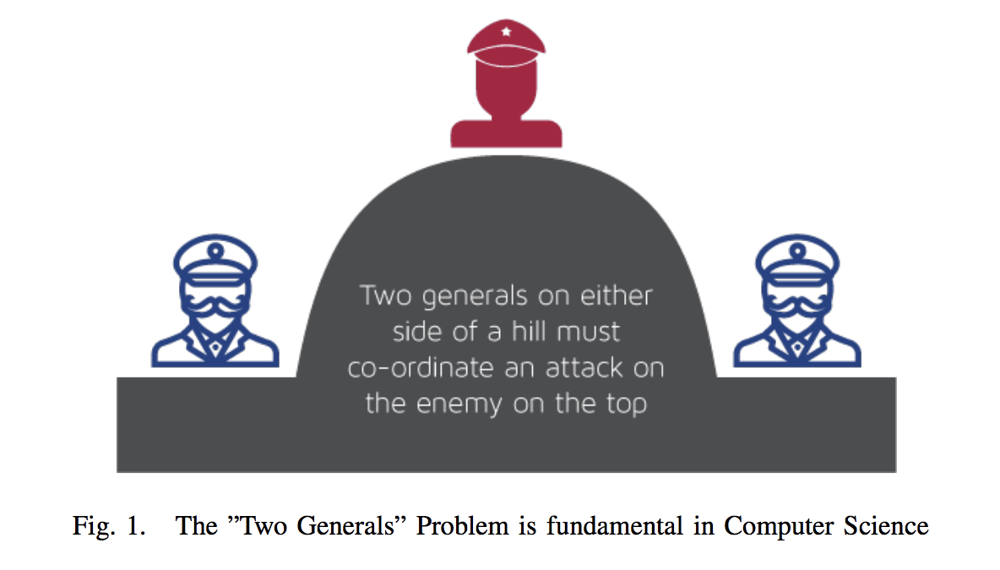
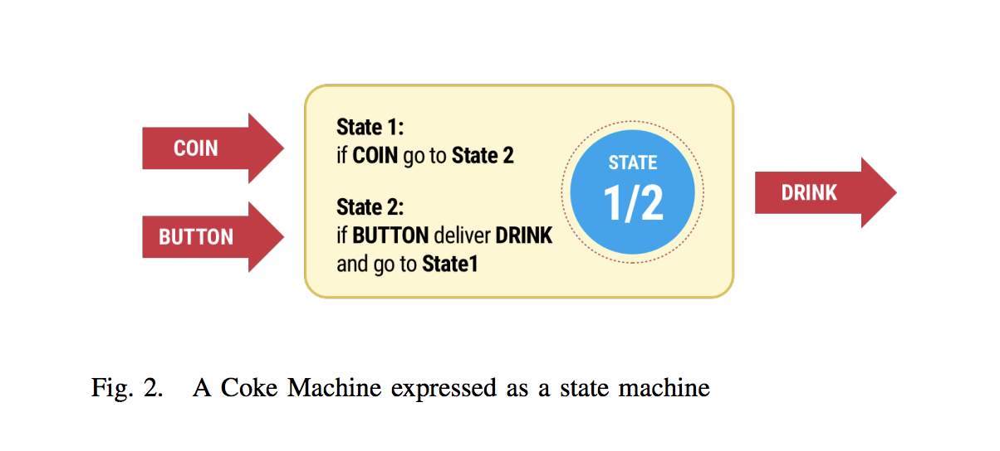
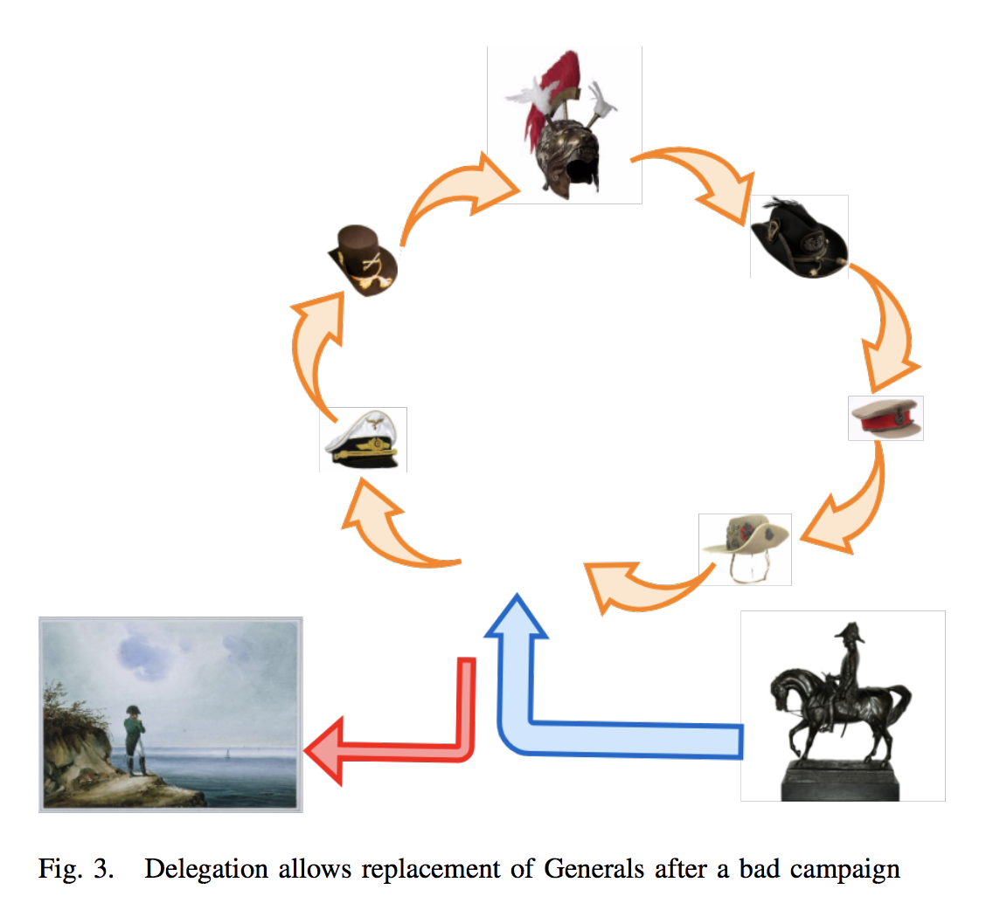
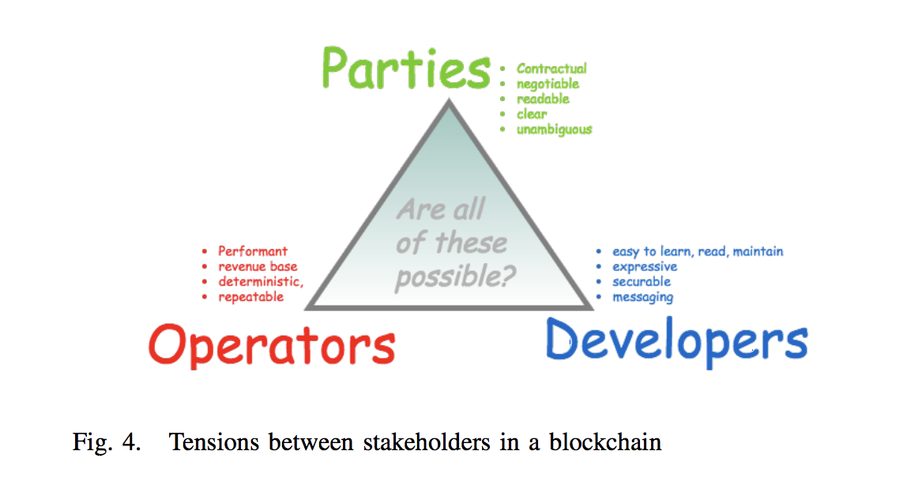
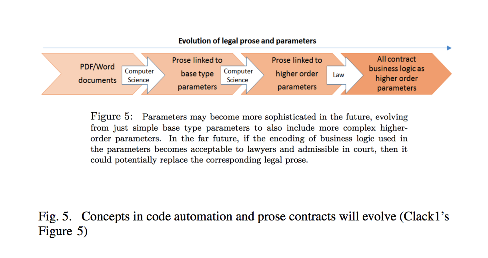
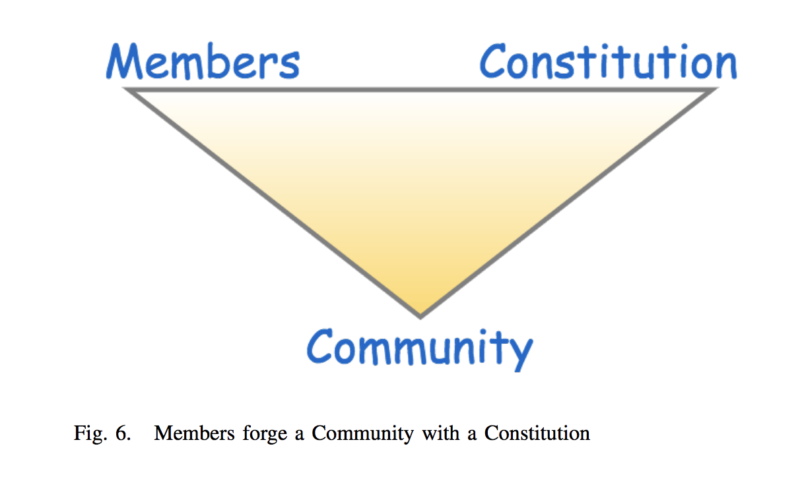
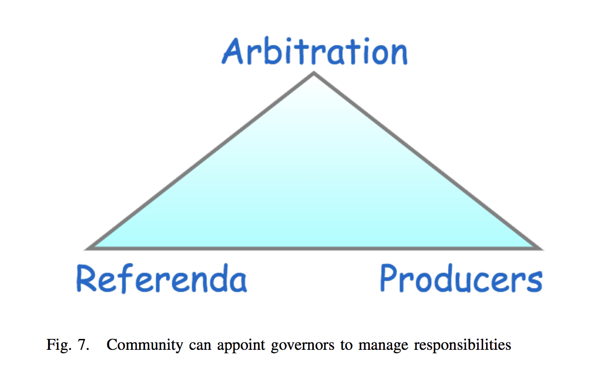
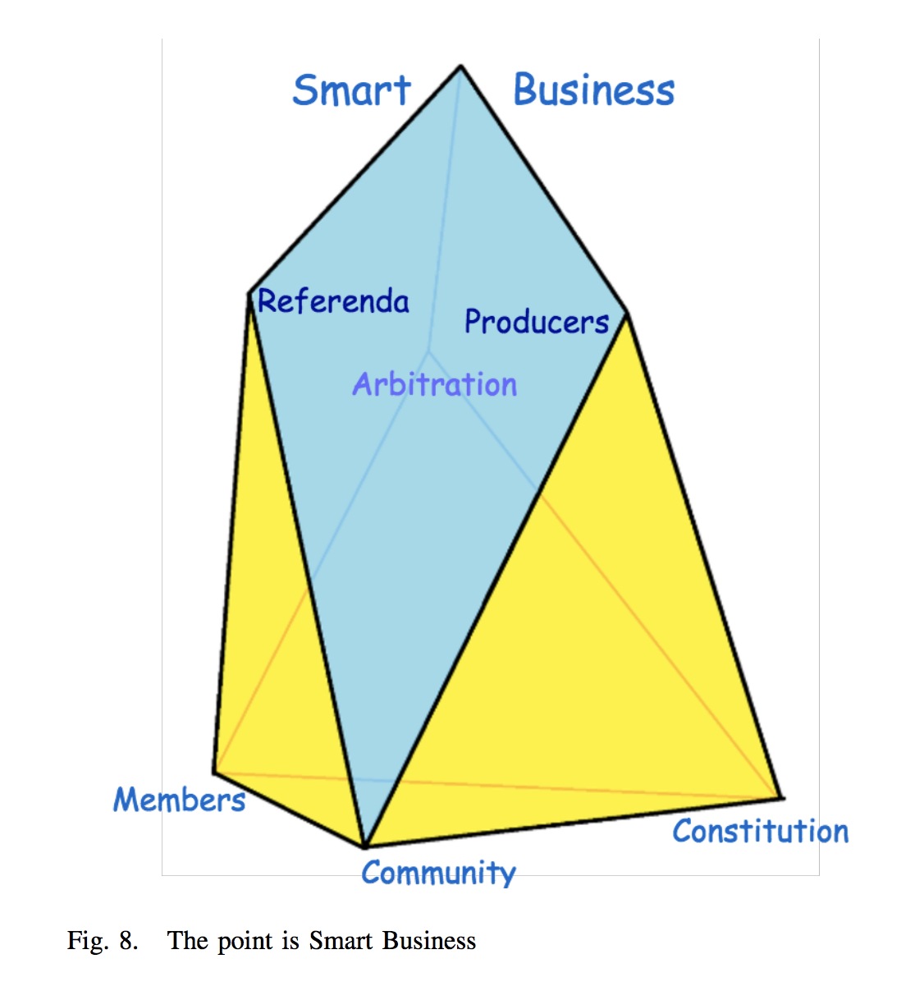

# Introduction to EOS

## "EOS - An Introduction" by Ian Grigg


Source and acknoledgement: [https://eos.io/documents/EOS\_An\_Introduction.pdf](https://eos.io/documents/EOS_An_Introduction.pdf)


### Abstract

**Current technologies for blockchain fall short of providing what developers and end-users need in order to contract together and to build large scale businesses. We propose EOS, a performance-based and self-governing blockchain that provides an operating system for building large-scale consumerfacing distributed applications. This paper outlines the context, vision and software architecture underlying EOS, which we are building to serve a broad and diverse group of users with smart business. Keywords—EOS, blockchain, smart contract.**

### I. Introduction

The notions of digital cash and smart contracting have been known for a long time, yet only in recent times have strides been taken with respect to implementation.

This paper introduces the EOS.IO software underlying EOS as a new platform for general value and contracting. EOS is presented against a backdrop of three existing champions because \(a\) they represent a broad range of opinions as to the Distributed Ledger Technologies \(DLT\) space, \(b\) are large enough to matter, and \(c\) are familiar to the author.

Bitcoin \(Nakamoto 2008\) seemed to be the word on a blockchain that promised the inspirations of both digital cash and smart contracts. Although it captured the attention of the cypherpunks, media and hodlers, it failed to make a mark on business. Ethereum \(Woods 2014\) attempted to fulfill the smart contract promise with an “unstoppable world computer” while Bitshares \(Larimer et al 2014\) strove to open up the market for tradeable assets. Hundreds of alternative Bitcoin blockchains or altcoins strove to make a small difference seem louder. Corda \(Brown et al 2016\) backed away from blockchain entirely and explored party to party workflow solutions.

We are tantalisingly close but no prize has yet been awarded - by the end-users. It is timely to then take a fresh look at what the demand is for, from their perspective, and lay down the basis and a vision towards creating a practical and performant blockchain trade infrastructure. First, we summarise the Context of today’s market for DLTs. Then, we look at a Vision of the end-user’s needs, and how to meet them. Then, we review an Architecture to meet the market demands.

Finally a quick Comparison with known systems and Concluding remarks. For more technical details on the EOS.IO software, readers are referred to “EOS.IO Technical White Paper” \(Larimer 2017\).

### II. Context

**The Market.** The market is competitive for all products and DLTs or blockchains are no exception. What are the market offerings? Bitcoin might be seen as the chain of security, yet a strong chain is only as valuable as the business it is attached to. Perhaps recognising this, Ethereum touted the worldwide unstoppable Turing computer, a goal that might appeal to computer scientists but has seemed elusive to other disciplines. R3 built Corda to serve the needs of the financial institution, which is a large market but also an expensive and exclusive one.

This section examines those prior systems from the perspective of major architectural features or necessities, which suggests benchmarks or assumed starting points that industry looks to.

**Consensus.** With blockchains, we come to consensus over a block of transactions, such that no transaction conflicts with any other, neither in this block nor prior blocks. Also known as the Two Generals Problem, there is a rich history in bringing remote actors to agreement such that “I know that what you see is what I see.” See Figure 1.

Bitcoin established proof of work or the Nakamoto signature as the way to bring an open entry community together over a shared or distributed ledger in which all parties hold a complete copy. This mechanism runs a lottery amongst many miners to determine who mines each block. Tickets in the lottery are competed for by a SHA2 puzzle, and as this requires energy to produce, the winner of the lottery is rewarded with a fixed amount of Bitcoin. In effect, anyone can be a General, and the one that wins the lottery is the one that sets this moment’s plan of battle. Following Generals can choose to accept that plan or block, or reject if invalid.

The fully shared ledger and the cost of proof of work, running at 4% for Bitcoin and 11% for Ethereum at the time of this paper’s writing, have offended many. Permissioned ledgers \(Swanson 2015\) were proposed to not only block those we want to exclude from enjoying the benefits of our ledger, but also to bring us back to the computer science roots of efficient consensus - practical but centralised designs well known in database science. Also proposed from time to time are proof of stake, exotic cryptography and secure enclaves. Corda \(Brown et al 2016\) established that consensus could be a user choice at select points within a contract of transactions. By allowing interchangeability of servers called notaries that can mediate the consensus by any of the above means, Corda reduces the network operating cost to a level comparable to today’s IT infrastructure.

**Value.** Similarly, there are a wide variety of mechanisms to establish a fungible value such as cash. Smartcard money in the 1980s - 1990s was typically implemented through persistent internal data stores in each card that negotiated atomic dualcard transactions. In the same timeframe, David Chaum’s eCash \(Chaum 1983\) popularised the notion of a coin, being a random number with a blinded signature that could be handed from user to user. Triple entry \(Grigg 2005\) established that each party could see the same receipt, each of which recorded a person to person transaction. Balance is calculated as the sum of receipts going in and out.

Bitcoin uses the UTXO or unspent transaction output concept, a state-driven layout. Each transaction record spends a set of previously unspent values, and creates new spendable values into the future. In contrast, Ethereum’s virtual machine provided a database mechanism such that a currency could be constructed from a table, a significant improvement in flexibility, but opening up a wide surface area for attacks.

These five distinct mechanisms suggest that the way to account for value is not settled science.

**State Transition.** Bitcoin’s block as a list of UTXOs, above, lays a claim to state, being the nature of those coins, that block, that chain, at that time. The duality of the UTXO design derives from the need of the lightweight or ‘SPV’ client to prove its incoming coins in a shared ledger: A receiving client with only limited access need only trace each single ‘coin’ from a block position back to its origin in order to determine that an incoming transaction is good. The receiver does not need to prove anything outside of the incoming coins, such as the sender’s balance, in order to ensure complete control of the value.

This powerful statement that the blockchain is a graph of state was adopted broadly within the distributed ledger field. Even as Ethereum replaced the UTXO with its more powerful virtual machine, it accepted that state was the point of consensus over which all nodes need to reach. On arrival of a new hashed block, each validating node calculates and agrees on the precise exit state resulting from all contracts found in each new block.

**Contracts.** Bitcoin added business logic to money by attaching validation ‘scripts’ to its transactions to suggest a limited form of contracting, which popularly became known as smart contracts \(Szabo 1994, 1997\). Ethereum’s notion of the unstoppable worldwide Turing computer provided more fully powerful coding, messaging and data storage. Corda pared back these designs to validate and agree over UTXO-like state with command-driven changes, but also limit access to only the direct parties for confidentiality. Both Ethereum and Corda introduced more powerful high-level languages with which to express contracts.

**Performance.** Bitcoin has established a general limit of about 3 transactions per second \(TPS\), at which point transactions can be severely delayed. Ethereum seems to be stretched at 15 TPS, and a recent congestion event was marked by a $2000 transaction fee to jump the queue. The limits on a blockchain’s throughput are many: validating prior claimed blocks, processing the new block, and mining. Corda avoids these limits for the most part, as its consensus is via selectable, independent and localised notaries, as there is no need for wider consensus than the parties. Every system is encumbered by the physical limits of network propagation times.

**Use Cases.** Notwithstanding the hype surrounding blockchain, there is relatively little hard evidence of successful use cases. Bitcoin establishes a single currency, but the explosion of altcoins, the failure of colored coins, and the absence of any smart contracts of interest suggest clear limits. Ethereum tried to break those limits but to date success eludes, unless one considers the somewhat circular use case of raising funds on the promise of future use cases, as marked by steady traffic in ERC-20 contracts. Perhaps surprisingly, the progenitors of EOS number are two ‘interesting’ use cases that have reached production and scale, being a distributed exchange \(Bitshares\) and a social media site \(Steem\). The promise of smart contracts, however, remains elusive.

**Governance.** To this author, the critical discovery of Bitcoin is not that we can mediate with cryptography, or that the design is stable with decentralisation and open entry, but that it must preserve these characteristics to survive. Entry by all is not only key to the consensus model of hash-mining over the distributed ledger, it is also key to the survivability of the system. Previous digital cash systems failed because there was a centre, which was attacked in one way or another, showing a failure in governance. As if to provide further abundant evidence, centralised exchanges in the Bitcoin era are frequently attacked with thefts, contract breaches, denials of service, bankruptcies, seizures and enforced rule changes.

Then, the world divides generally into two: fully decentralised open entry systems typified by blockchains, and the converse typified by centralised and permissioned ledgers, with the space between the two being uncertain. Bifurcation over open entry raises the question of how the users govern, are governed, and how governance for the benefit works - in both cases.

The general approach in open entry starts with caveat emptor, which carefully sets a technical environment that is capable of most of what is required, but with enforcement of rights limited by what can be automated in code. Sometimes labelled trustlessness, this regime draws a stark line between that which is technical and strong as a chain, and that which is at the user’s discretion and therefore more dangerous. As time goes on, institutional approaches such as improvement proposals and centres of power such as foundations or teams arise to deal with some of the dangers to users, to a greater or lesser degree and success \(Gupta 2014\). Caveat emptor is typical of Bitcoin and Ethereum.

In contrast, in the permissioned network or walled garden approach, only those permitted can enter and act. In this scenario, parties open an account, are onboarded by an agent and can trade with a presumption of good behaviour. Implicitly or explicitly, enforcement of good behaviour is typically seen as out of scope at the technical level, although dentity typically plays an unclear part. The downside is that the wall around the garden can be expensive to erect and maintain, and every year the gatekeeper charges more. This approach is commonly assumed within heavily regulated markets such as banks and the like, and is used by Corda.

Neither of these world states are user friendly - users lose too much money through caveat emptor, and systems that start from ‘permission’ become systems that discriminate, either at the competitive level or the societal level. Users are routinely skeptical of either.

### III. Vision

**End-state Goals.** What is it that our user needs? In the abstract, she wants to:

* Know her friends, business partners, and customers.
* Communicate with them.
* Be able to contract with them:
  * in the small, make peer to peer agreements, and
  * in the large, build a sophisticated business to be able to serve the market.
* Be able to retain and direct her value \(pay bills, etc\) as a necessary component of business.
  * Then, all has to be done safely and securely.
* Be able to invest in a predictable business. This is a complex issue, but appears to require three components.
  * Know that the ecosystem is advancing, and not at undue risk of failing.
  * Pay for development effort up front with reasonable payback in the future.
  * Because she knows that things - contracts, assets, transactions, intents - go wrong, she wants to be able to fix her difficulties. Including, with her friends, her business, and her assets, and quickly, cheaply and without undue escalation. 

One caveat of arrogance: we assume her wants and her needs are synonymous. More precisely, we are making an entrepreneurial judgement call over what we believe the user needs, and she’ll want it when she learns about it.

**The Big Idea.** It has become abundantly clear that for one reason or another, the promise of universal peer to peer contracting and money has been excluded to the wider Internet. Bitcoin is too unsafe, and its smart contracts opaque. Ethereum is too scary, too hard, too geeky. Corda is ‘big corporate.’ Other systems have their weaknesses, all of them are restricted to the elite coder, and everyone has a different view.

What is needed is smart business for the everyday person. An everyday distributed application needs to live in a global blockchain that handles the open entry treasured by the Bitcoin discovery, has enough performance to build big business, is connected enough to bring people together and is safe and secure enough that Wall Street’s Gordon Gecko can trade alongside Africa’s Mama Biashara. Without drama, without fear, without missing out.

**The Target.** The vision before us is a single global contracting blockchain that can scale up to handle a long-tail of businesses negotiating contracts for mutual advantage in a safe and secure environment.

In more practical terms, while there is much of value on the Internet, we focus on what is mediated by the web, and leave aside mobile and applications for now. What does a builder of a web application want? We assume that the target user is the web entrepreneur, and therefore let’s work backwards from that position.

**Principal Features.** Our design predicts a blockchain to handle thousands of transactions per second for business contracts that are captured in easy to use and easy to secure languages. The major features include:

* High performance messaging using event sourcing
* Delegated Proof of Stake
* Contracts as negotiation and intent - messaging at its heart
* Usability from the user to contract writer to developer to entrepreneur
* Governance for business and chain maintenance The following section explores in more depth.

### IV. The Architecture

**The Philosophy.** In large part the practical approach of the software underlying EOS is to extend the large-scale highperformance blockchain experience in Bitshares and Steem to support end-user business. Most of the elements have been proven to a lesser or greater extent, this architecture re-assembles them for a new purpose - to build distributed applications.

This section describes some important architectural differences that the software underlying EOS proposes against prior practice. For more technical details, readers are referred to the EOS.IO Technical White Paper \(Larimer 2017\).

**The Message is the Medium.** The EOS.IO software design switches from the more popular consensus over state to the less familiar consensus over events \(Grigg, 2017-1\). This approach marries the event sourcing pattern \(Fowler, 2005\) to a blockchain made of events rather than state.

In computer science, a deterministic state machine is built as a machine of code, state \(memory\), and events, both in and out. Every time something happens which causes a change, a practical machine saves intermediates to memory, and on restarting it recovers itself by reading back those intermediates. In building a practical state machine, we have a choice between saving events or saving state, which choice depends mostly on what we are trying to optimise.

In Figure 2, are we to save the red messages or the blue state? A machine saving state is more likely to be used in a context where we focus on what state it is in now, for example databases. A machine saving messages as intent is more likely to be useful when asking how we got to the state we are in now, for example protocols or legally significant logs such as triple entry accounting \(Grigg 2005\). Restart is faster with saved state, throughput is faster with saved messages.

Because users need performance, the design saves messages. Restart of a messaging or event sourced machine is similar to recovering from the beginning, therefore incredibly slow, and optimising startup means saving checkpoints - back to state again. But, and here is a crucial outcome, in saving that state, an actor remains bound by the saved messages, not the state, so we can optimise heavily and even recalculate the checkpoints if needed. Precisely how we optimise is too big a topic for this introduction, but suffice to predict that the combined techniques can in theory take blockchain from 3 transactions per second to 3 million.

**Consensus.** For consensus over messages, the EOS.IO architecture uses Delegated Proof of Stake \(DPOS\), a two-tier governance structure proven in Steem and Bitshares \(Larimer 2014\). In the first tier, block producers are elected into a round of 21, each producer gets one block per round, and is rewarded for the validation of incoming messages and production of the block of messages. A block released by one producer is validated by the next and the next and so forth; if not validated, it is not built upon. Similar longest-chain mechanics to Bitcoin are followed, and in short order, the producers converge on a longest chain. A block that is accepted by a quorum of producers is declared immutable, and the chain of immutable blocks becomes in effect a checkpoint.

Like proof of work, producers can censor \(ignore\) messages, or they can front-run by introducing their own from their superior knowledge of the future. To provide light-touch governance over bad acts by producers, each round of producers is continuously elected by the community using proof of stake \(PoS\). As this second tier blockchain-mediated election is over the producers and not the blocks, the so-called “nothing at stake” weakness does not apply. In effect, a set of Generals is chosen for a campaign, and each get one turn. After the campaign, the civilian community asserts its view to replace any bad Generals.

DPOS avoids the tax of mining, releasing that substantial value back to stakeholders. Value from block rewards would be initially captured entirely by the producers. However, because they are elected by the community, they are incentivised to share the rewards by a scheme that producers agree on amongst themselves, and promote to the community.

By constitution, the long term reward for producing blocks can be limited to for example 5% per annum \(Larimer 2017-2\). By custom, we suggest that the bulk of the value be returned to the community for the common good - software improvements, dispute resolution, and the like can be entertained. In the spirit of ‘eating our own dogfood,’ the design envisages that the community votes on a set of open entry contracts that act like ‘foundations’ for the benefit of the community. Known as Community Benefit Contracts, the mechanism highlights the importance of DPOS as enabling direct on-chain governance by the community \(below\).

**The Contract.** The architecture comes closer to the nature of contracting by treating contracts as a dynamic expression of negotiation, commitment and events, rather than the more static interpretation of ‘the four corners of the page’ or the performing code within a machine. We propose that messages are the natural element of contracting, as they better capture all phases of successful contracting: negotiation, intent, performance and breach of obligations are all events better captured as messages than, say, state.

A user writes a contract as a virtual construct of interlocking handlers of messages. A user can convert her account into a contracting agent by adding message handlers and using her account’s inbuilt database-like store to hold the internal position of her contracts. Several message handlers working together can mediate a flow of messages so as to perform a complete contract or legally sound agreement through its lifecycle.

From the perspective of a contract, the arrival, acceptance and processing of a message is a simpler abstraction than state. Consider an order processing book as seen in a market for exchange: the book accepts bids to buy and offers to sell. When the time comes, it has to calculate a price at which to cross, and then issue accepted orders to both sides.

An order book in a messaging-based system is committing to its set of incoming messages and outgoing set of messages, which is a relatively tractable task. In contrast, in a fully state based system, all traders have to negotiate the acceptable state to all of many parties, including quantities and prices, before submitting a final state to the blockchain. This implies that traders would get to peek at the solution before agreeing, opening the door to game-playing. In practice, the only known way to solve this problem is with agents and messaging. An active agent receives committed messages, decides on the outcome, and sends out messages committing to that outcome.

**Usability.** The direct user of a blockchain is the developer who creates web apps for her end-users. To support an enduser, the software must support the developer, first and foremost, and it must do so in ways that help the developer to support her users. High impact support for the the developer includes \(a\) the tools, \(b\) the language, and \(c\) the environment.

In the large, the EOS.IO developer will be supported by a web-based toolkit that provides a fully-serviced framework on which to build applications as distributed web-based systems coordinating over the blockchain. Accounts, naming, permissioning, recovery, database storage, scheduling, authentication and inter-app asynchronous communication are all built in. A goal of the architecture is to provide a fully-provisioned operating system for the builder of apps, focussed to the web because that’s where the bulk of the users are.

**Language.** Within our context of industrial scale distributed applications, the language for writing contracts is high on the impact list. Most every other architectural feature in the EOS.IO software has solid foundation that is proven in Bitshares and Steem, whereas the addition of smart contracts stands out as uncharted territory.

It behoves us to analyse the language needs carefully. From the point of view of selecting technology for automated or smart contracting, the three stakeholders critical for success are: the parties, the developers and the operators.

* The parties need a contract that is, first of all, an actual contract. Parties also want the contract to be negotiable, readable, clear, and unambiguous - they need their human intent to be captured faithfully. Preferably, contracts should also be supported by options for dispute resolution and enforceability.
* The developer needs the language and wider system to be easy to learn and write in, as well as expressive and securable, goals that often ignore higher semantics or contractual intent.
* Meanwhile the operators of the blockchain - producers of blocks and full-node app businesses - need the contract to be scaleable and provide a reasonable basis for earning some revenue, interests that have little to do with human intent or developer expressibility. 

Taking the parties’ needs first, this pushes us in the direction of melding plaintext legal prose tightly with computer code, glued with some parameters to “drive the deal” and reuse the prose and code over many contracts \(Grigg 2015\). Many research efforts aim to merge the two contract views of code and prose together as either higher order parameters or a legally expressive domain specific language \(Clack1 et al 2016 see their Figure 5\) but none have as yet found this holy grail. This is an open research area with unsettled design choices \(Clack2 et al 2016\).

Along those lines, our first temptation was towards the developer: a source-interpreted scripting language based on Wren, and customised to manage the design of a contractual message handler. Example code snippet \(Larimer 2017-1\):

`apply:    
// assuming all prior steps pass,    
// perform the state transition    
// that updates balances and/or    
// creates a new account for receiver    
var from = Balance[message.from]    
var to = Balance.find( action.to )    
from.bal = from.bal - action.amount    
to.bal = to.bal + action.amount`

This hybrid of Wren is simple to learn, read, and reason about, making it ideal for automated contracting. However, it proved to be slow: a trial of trivial transactions capped out at 1,000 TPS, which brings us into collision with the needs of operators, our producers and application businesses.

As we are aiming for 100 times that level, the team switched to WebAssembly \(WASM\) which is a new intermediate language designed to do the job that Javascript currently does within browsers. WASM’s first unoptimised trial within the EOS framework delivered about 50,000 TPS for a currency contract.

Yet, WASM switches the challenge from the operators to the parties - there are now 3 tangible views over any contract: legal prose, source code initially in C and intermediate code in WASM.

Thus it is a reasonable question to ask - what or where is the contract that the parties agreed to? I would like to face that question head on. In the two decades or so that I have seen contracts issued on the net, as Ricardian or otherwise, and the hundreds of issues that have arisen from these contracts, I have yet to see a dispute, or even a confusion where what the contract said or meant was key to the dispute. Even with The DAO, that ill-fated $150 million lesson in how not to issue a contract, the proximate cause was \(in\) security, and regardless of which side of the fence one fell in identifying the contractual significance of the hack, the response was to arbitrarily change whatever needed to be changed to get the money back. There was no organised, formal or even a vestige of an attempt to resolve the dispute over interpretation of the facts, the meaning and the rights. It is an open question what proportion of disputes in court are over meanings and confusions, and what percentage are simply power plays and bullying, but I am not optimistic.

In the face of The DAO and other experiences, I suggest that the rule of one contract \(Grigg 2004\) looks dogmatic and overly constricting. Instead, at least for the unregulated part of the DLT space, there is opportunity to free up the components of the contract to achieve better performance, even at the expense of a little misalignment. Meanwhile, we should focus on governance, and making dispute resolution available and comfortable to the parties.

As of the time of writing, the set of languages available to the contract developer is a work in progress. Whether WASM or Wren or another, we will still need to structure the language for performance and usability. Each named message handler will need to identify sections for each of static, readonly and read-write code, each having different potentials for optimisation. To eliminate re-entrant issues, outgoing messages will be stacked until completion, or dropped on failure. We intend to add a SQL-like table structure to significantly ease adoption by those who are familiar with databases. Crypto will be external and mostly invisible.

As with the entire space for DLT, the competition continues internally. Wren is small and tight. WASM is only just out of standardisation. WASM’s early tools target C and C++ which are popular but are more costly to write code in, in comparison to high level late-generation languages such as Wren. These challenges should not be insurmountable in the longer run as the WASM project is intended to work with most languages, and the bulk of the code in any DApp is outside the handlers, in the websites. The ability to accept many popular languages is enticing, an advantage available to Corda’s JVM but not easily reachable by Bitcoin or Ethereum without a holistic approach to the developer cycle.

In conclusion, there are dramatic compromises in the choice of language and toolkits for the developer that go beyond mere codability. We would like an easy to read and reason scripting language that could speak in full contractual terms, be securable and be scaleable. But at the current state of the art, compromises have to be made.

**Governance.** Let us now turn to the environment. It is a reality that things go wrong with automated processing of contracts, to the distress of all. It is our hope to reduce both the frequency and the cost of those errors, but they cannot be eliminated entirely, and our approach is to build in remedial methods for when they do occur.

A blockchain based on EOS.IO software assumes that all who use the blockchain are members under a short Constitution \(Larimer 2017-2\) \(Grigg 2017-3\) and by agreeing to which, all members form a Community subject to the Constitution.

The Constitution sets down some basic rules for the benefit of the community. The Constitution empowers three arms of governance: arbitration for resolving disputes, block producers for choosing blocks, and referenda for community voice. Arranged in an interlocking triangle of governance, these three arms support and counterbalance each other. Referenda are used by the community to vote in the producers and arbitrators, as well as changes to code and constitution. Arbitrators can deliver legally binding rulings to resolve disputes, and also for extraordinary changes such as hard forks. Block producers are at technical liberty to censor bad transactions or introduce remedial ones - but are mindful of community reaction. Arbitrators publish rulings, which producers might enforce, or users might seek external enforcement.

This counterbalanced arrangement ensures that no party or group has total power. Even founders or developers have only limited ability to affect the rights of the community members. Hard forks and other upgrades have a defined path, and individual disputes are channelled to a place where we can resolve and get back to business. A further benefit is that most of the above governance can be handled transparently, that is by writing contract handlers to accept and manage disputes, handle referenda and the like.

To make these institutions work, users have to agree to the Constitution, which empowers the producers to choose blocks, and reserves all disputes into the forum of arbitration. As well, the Constitution creates the legal rights expressed in the blockchain by stating that each member receives those rights properly accounted for, and in return each member supports the accounted rights of others. This trade of your rights for the rights of others becomes the cornerstone of the community, in that the community is defined by both the usage of the platform and the agreement to the Constitution.

And thus we have preserved open entry even as the Community governs itself internally. Even as a user transacts, all transactions from the first entry to the latest refer to the Constitution by hash, as a Ricardian Contract \(Grigg 2004\). As an explicit governance mechanism, the constitution creates more of a fenced field than a walled garden, and the gatekeeper is automated as a transaction or signpost at all points.

### V. Comparisons

**Bitcoin.** As the platform that launched the first and most successful cryptocurrency, Bitcoin is a baseline. Yet, as the ‘first’ its flaws shine as bright as its success: The UTXO verification model means that complex smart business has to be mediated through external code. The state is nicely locked on chain, but the hard work of negotiation is done by the applications. It has no good framework for assets, especially as each transaction includes BTC, and is thus an affront to Gresham’s apocryphal warning against commingling of assets, good money drives out bad. Its lack of a thoughtful governance layer results that upgrades are very difficult, and the community is at war with itself. For example, the artificial limit of 3 TPS that kills its scalability is because of the absence of governance.

**Ethereum.** To rectify Bitcoin’s weaknesses, Ethereum establishes a Turing-complete virtual machine capability on a world-wide computer. It has several major shortfalls. Firstly, it has a dramatically restricting requirement to find consensus on state over thousands of program executions, leading to resource congestion at around 15 TPS. Secondly, the decision to go-italone on languages, VMs, toolkits and the like has caused a drag on developer capabilities. Thirdly, it suffers from the adhocracy of the Foundation that has emerged despite the refusal of major stakeholders to recognise the need for governance. As an emergent business proposition, use of Ethereum has been dominated by raising funds for projects mostly aimed at finishing Ethereum as a platform, or competing with it. Few novel use cases have made their mark, suggesting that there is more work to do before the Ethereum concept of smart contracts bears fruit.

**Corda.** The primary distinguishing factor of Corda is that it is not a blockchain but a framework for party to party workflow. Instead of posting contracts and actions to a blockchain, parties exchange messages and come to consensus via notaries. It achieves confidentiality for parties, high performance unconstrained by chain coordination, and the ability for parties to control the contracts as they succeed and fail. Yet workflow works best with small numbers of parties, not large, and hence it is weaker on issuance of assets, especially cash and cash-denominated trading. Another weakness is that Corda’s walled garden approach for regulatory business stops it being an attractive mass market for small players.

### VI. Conclusion

**User experience.** The direct users of a blockchain such as EOS are the entrepreneurs and developers who write contracts to implement distributed applications or DApps. Their users are the routine customers in retail, finance, logistics, media. Those latter customers do not need to know what a blockchain is. Hence the goal is to give the developers a platform that allows extensive business logic to be built, but the mechanisms of communication are hidden.

The DApp developer is given a fully capable accounts, permissioning and messaging platform in which to express the system. The user interface matches what users are familiar with - a webkit for building websites and of course access to the blockchain. This approach is expressed as “an operating system for blockchain.”

The fact that there is a blockchain can be hidden from the user, as exemplified by Steem, being just another blogging platform that happens to be distributed on a blockchain.

**Use cases.** An EOS blockchain is intended for highperformance messaging with business logic. Popular use cases will include supply chain, resource management, usermessaging such as social media, asset issuance and trading, accounting for remittances, and gaming.

A typical use case might be Uber. Ride-sharing is based on setting standards of behaviour for the driver and for the passenger. If drivers and passengers were part of the same community, there would be an immediate benefit - the base of liability and standards of behaviour would be covered under community constitution and dispute resolution, and their contracts could be bilateral rather than intermediated, thus minimising any regulatory difficulties.

Then, as the contracts can be bilateral, the business flow could be split up: tracking passengers in the market, tracking cars available, finding a match, negotiating a contract, performance, settlement, pricing, and social tracking could all be built as separate DApps that interact.

**Community.** To support business, we need to solve problems. And to scale the solving of problems, it has to be done by the community itself, which means it has to be in the architecture. To advance community, we must preserve open entry, but on entry provide the tools that users find useful for governance. Users want to determine their risks and obligations to their counterparties.

When bound together as a community under a Constitution, users will know that the rights, liabilities and obligations of their counterparties are at least to a basic standard, as expressed in a constitution and as enforced in dispute resolution. In addition reliable names and a web of trust can reduce the anonymity of the Internet and give people a sense of belonging to something important.

ACKNOWLEDGMENT

This paper received useful feedback from Brendan Blumer, Arthur Doohan, Dan Larimer, Wendy Lee, Aaron Leibling, Konstantinos Sgantzos, Joseph VaughnPerling, Kokuei Yuan.

REFERENCES

\[1\] Richard Brown, James Carlyle, Ian Grigg, Mike Hearn, “Corda: an Introduction” 2016  
\[2\] David Chaum, “Blind Signatures for Untraceable Payments”, 1982 UC Santa Barbara [http://blog.koehntopp.de/uploads/Chaum.BlindSigForPayment.1982.PDF](http://blog.koehntopp.de/uploads/Chaum.BlindSigForPayment.1982.PDF)  
\[3\] Christopher D. Clack \(1\), Vikram A. Bakshi, Lee Braine “Smart Contract Templates: foundations, design landscape and research directions”, 2016  
\[4\] Christopher D. Clack \(2\), Vikram A. Bakshi, Lee Braine “Smart Contract Templates: essential requirements and design options”, 2016  
\[5\] Martin Fowler, “Event Sourcing”, 2005 [https://martinfowler.com/eaaDev/EventSourcing.html](https://martinfowler.com/eaaDev/EventSourcing.html)  
\[6\] Ian Grigg, “The Ricardian Contract,” 2004  
\[7\] Ian Grigg, “Triple Entry Accounting,” 2005  
\[8\] Ian Grigg, “The Sum of All Chains - Let’s Converge,” 2015  
\[9\] Ian Grigg, blog post “The Message is the Medium,” 2017-1  
\[10\] Ian Grigg, blog post “Seeking Consensus on Consensus,” 2017-2  
\[11\] Ian Grigg, blog post “A Principled Approach to Blockchain Governance” 2017-3  
\[12\] Vinay Gupta, interview “Bitcoin Cannot be divorced from pre-existing political theory,” 2014  
\[13\] Daniel Larimer, “Delegated Proof-of-Stake \(DPOS\)” 2014.  
\[14\] Daniel Larimer, Charles Hoskinson, Stan Larimer, “A Peer-to-Peer Polymorphic Digital Asset Exchange” 2014.  
\[15\] Dan Larimer, “EOS.IO Technical White Paper” block.one 2017 [https://github.com/EOSIO/Documentation/blob/master/TechnicalWhitePaper.md](https://github.com/EOSIO/Documentation/blob/master/TechnicalWhitePaper.md)  
\[16\] Dan Larimer, block post “Implementing a Hypothetical Currency Application on EOS,” 2017-1 [https://steemit.com/eos/@eosio/implementing-a-hypothetical-currencyapplication-on-eos](https://steemit.com/eos/@eosio/implementing-a-hypothetical-currencyapplication-on-eos) \[17\] Dan Larimer, blog post “What could a blockchain Constitution look like?” 2017-2  
\[18\] Satoshi Nakamoto, “Bitcoin: A Peer-to-Peer Electronic Cash System ” 2008  
\[19\] Tim Swanson, “Consensus-as-a-Service” 2015 [http://www.ofnumbers.com/wp-content/uploads/2015/04/Permissioneddistributed-ledgers.pdf](http://www.ofnumbers.com/wp-content/uploads/2015/04/Permissioneddistributed-ledgers.pdf)  
\[20\] Nick Szabo, “Smart Contracts”, 1994  
\[21\] Nick Szabo, “Formalizing and Securing Relationships on Public Networks”, 1997  
\[22\] Gavin Woods, “Ethereum: A Secure Decentralised Generalised Transaction Ledger”, 2014

